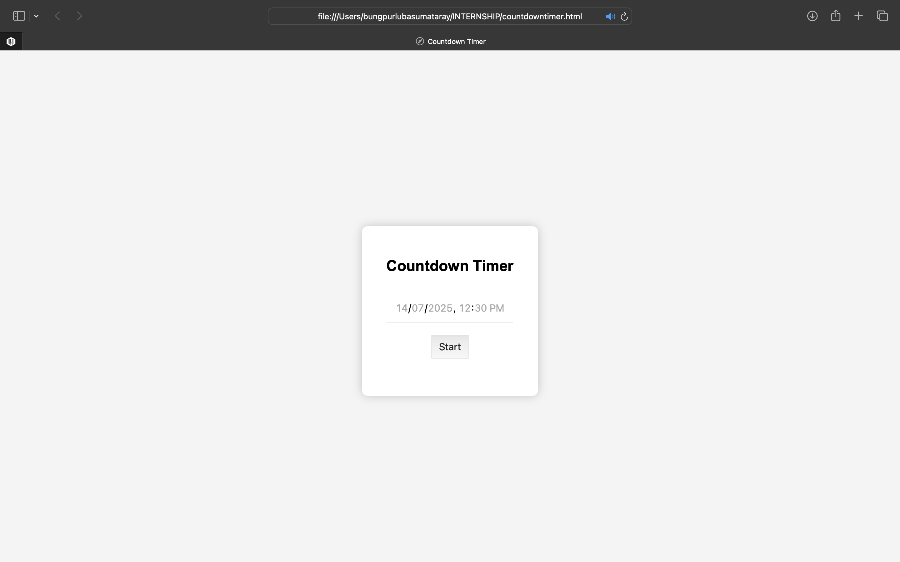

# ⏳ Countdown Timer

A simple, clean countdown timer web application created using HTML, CSS, and JavaScript. This project was completed as part of an online internship program.

---

## 🚀 Features

- 📅 Select a future date and time  
- ⏱️ Real-time countdown display (days, hours, minutes, seconds)  
- 🔔 Shows "Time's up!" message when countdown completes  
- 📱 Responsive design with internal CSS (no external libraries)

---

## 🛠️ How to Use

1. Download or clone this repository  
2. Open the file `countdown_timer.html` in any modern web browser  
3. Choose a future date and time  
4. Click the **Start** button to begin the countdown

---

## 📁 Project Type

**Internship Web Development Project (Online)**

---

## 👤 Submitted by

**Name:** Bungpurlu Basumatary  
**Program:** Web Development Internship  
**Date:** July 2025

---

## 🖼️ Screenshots

### 🖥️ Countdown Timer UI  

### ⏳ Countdown in Progress  

---

## 📄 License

This project is for educational and internship purposes only.  
© 2025 Bungpurlu Basumatary
